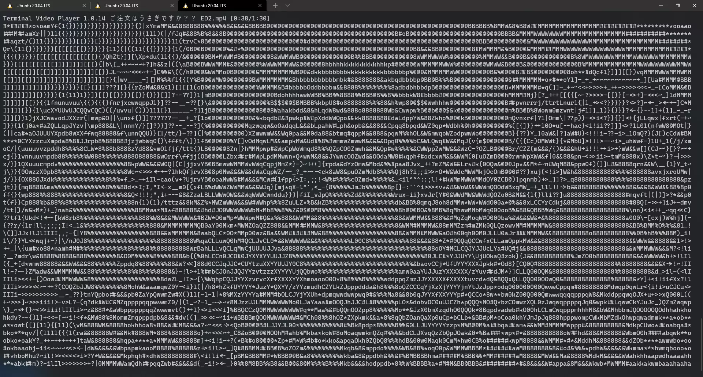
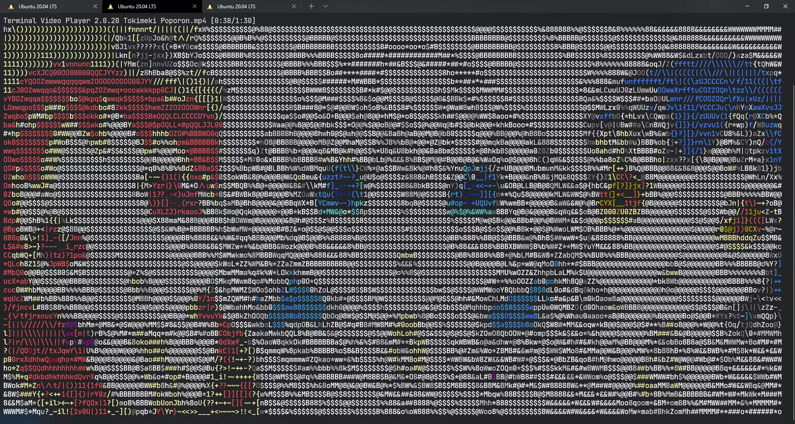

# Terminal Video Player

RIP My Eyes, Low Resolution Video Player driven by ASCII Characters

Don't Expect Quality from Here

## ✨ Features

- Play any Video, Right in your terminal [New in Version 2: WITH COLORS!✨]

- With audio!

- and Timestamp displaying in realtime

- with Resolution adjusted automatically depends on terminal window size!

## 🌿 Dependencies

- OpenCV 4.5
- CMake 3.16+ and gcc 9.4+
- libmpg123 and libao

  `sudo apt install libmpg123-dev libao-dev`

- FFmpeg

  `sudo apt install ffmpeg`

## ⚙️ Compile & Install

- `git clone https://github.com/Leomotors/Terminal-Video-Player`

- `cd Terminal-Video-Player`

- `mkdir build && cd build`

- Configure your terminal color at src/colors.cpp

- `cmake .. && make`

- `sudo make install`

- `tplay "Your Video File Name" [Optional: -cxx or -lxx (See src/process.cpp for more detail)]`

## Screenshots

Grayscale mode (from Version 1)

Color mode (new in Version 2)

Extra sample in [release notes](https://github.com/Leomotors/Terminal-Video-Player/releases/tag/2.0.28) of Version 2

## 🙏 Credits

- Audio Player is copied from [Here](http://hzqtc.github.io/2012/05/play-mp3-with-libmpg123-and-libao.html) Thank you for your Code!

- Misc Credits are in Source Code
